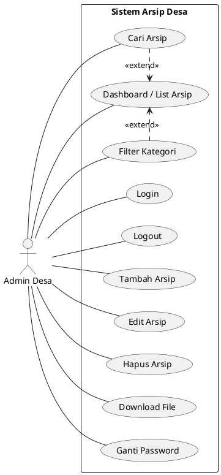
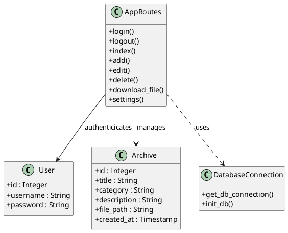

# BAB IV
# PELAKSANAAN KERJA PRAKTIK

## IV.1 Input

### IV.1.1 Data Primer
Data primer diperoleh melalui observasi langsung dan wawancara dengan staf kantor desa terkait proses pengelolaan arsip yang saat ini berjalan. Data ini mencakup alur kerja manual, kendala yang dihadapi dalam pencarian dokumen fisik, serta kebutuhan fitur yang diharapkan oleh pengguna (pengurus arsip desa).

### IV.1.2 Data Sekunder
Data sekunder diperoleh dari berbagai dokumen pendukung yang berkaitan dengan kegiatan administrasi desa, antara lain:
*   Dokumen arsip desa, seperti surat masuk, surat keluar, **Dokumen Peraturan**, laporan keuangan, serta **Gambar (Dokumentasi)** kegiatan desa.
*   Struktur organisasi Pemerintah Desa Sagaracipta.
*   Pedoman dan regulasi terkait kearsipan dan administrasi desa.

Data sekunder ini dimanfaatkan untuk menentukan kategori arsip, struktur data, serta perancangan basis data dalam aplikasi arsip digital.

**Tabel IV.1 Deskripsi Jenis Dokumen**
| No | Nama | Jenis | Keterangan |
|----|------|-------|------------|
| 1  | Surat Masuk | Docx, PDF | Informasi dari pihak luar desa |
| 2  | Surat Keluar | Docx, PDF | Informasi yang dikirim keluar desa |
| 3  | Dokumen Peraturan | Docx, PDF | Peraturan desa atau keputusan internal |
| 4  | Laporan Keuangan | Docx, PDF | Arsip data transaksi keuangan |
| 5  | Gambar | JPG, PNG | Dokumentasi foto atau gambar kegiatan |

## IV.2 Proses

### IV.2.1 Eksplorasi
Pada tahap eksplorasi, dilakukan analisis kebutuhan sistem untuk memetakan interaksi antara pengguna dan aplikasi. Hasil analisis ini dituangkan dalam bentuk Use Case Diagram.

#### A. Use Case Diagram
Use Case Diagram pada Gambar IV. 1 menggambarkan interaksi antara aktor **Admin Desa** dengan **Sistem Arsip Desa**. Diagram ini merepresentasikan fungsi-fungsi utama sistem yang diidentifikasi pada tahap eksplorasi berdasarkan kebutuhan pengelolaan dokumen dan arsip digital di kantor desa.

*(Catatan: Gambar di atas adalah preview. Gunakan kode PlantUML di bawah untuk membuat gambar berkualitas tinggi)*

**KODE UNTUK DISALIN KE PLANTUML (Gambar IV.1):**

> [!IMPORTANT]
> **PENTING:** Hapus semua teks di editor PlantUML Anda, lalu tempel kode di bawah ini. Pastikan baris pertama **HANYA** bertuliskan `@startuml` (jangan ada tambahan kata seperti `plantum!`).

Fungsi-fungsi yang direpresentasikan meliputi manajemen data arsip (CRUD), pencarian dokumen, pengunduhan file, serta pengaturan keamanan akun admin.

### IV.2.2 Pembangunan Perangkat Lunak
Tahap pembangunan perangkat lunak melibatkan perancangan struktur data dan logika program yang akan diimplementasikan ke dalam kode program. Untuk memvisualisasikan struktur kelas dan hubungan antar data, digunakan Class Diagram.

#### A. Class Diagram
Class Diagram pada Gambar IV. 2 menunjukkan struktur database dan entitas utama dalam Sistem Arsip Desa. Terdapat dua kelas utama yaitu `User` (untuk autentikasi admin) dan `Archive` (untuk penyimpanan data arsip).

**Struktur Class Diagram:**
- **Class User**: Menyimpan informasi login admin (`id`, `username`, `password`).
- **Class Archive**: Menyimpan data dokumen (`id`, `title`, `category`, `description`, `file_path`, `created_at`).
- **App Controller**: Menghubungkan logika bisnis (tambah, edit, hapus, cari) antara User dan Archive.

**Kode PlantUML untuk Gambar IV.2:**

*(Catatan: Anda dapat menggunakan struktur ini sebagai referensi saat menggambar di Balsamiq.)*

### IV.2.3 Struktur Tabel
Sebagai bentuk implementasi dari perancangan Class Diagram yang telah disusun, struktur data sistem arsip digital direalisasikan ke dalam beberapa tabel pada basis data SQLite. Setiap tabel dirancang untuk merepresentasikan kelas-kelas utama yang terdapat dalam Class Diagram, sehingga seluruh fungsi pengelolaan arsip dapat berjalan sesuai dengan perancangan sistem yang telah ditetapkan.

Berikut adalah detail struktur tabel yang digunakan:

#### A. Tabel User
Tabel `users` digunakan untuk menyimpan data autentikasi pengguna yang memiliki hak akses sebagai administrator desa.

**Tabel IV.2 Struktur Tabel Users**
| No | Field | Tipe Data | Ukuran |
|----|-------|-----------|--------|
| 1  | id | Integer | – |
| 2  | username | String | 64 |
| 3  | password | String | 255 |

Tabel IV.2 menyajikan struktur data dari tabel `Users` yang digunakan untuk menyimpan informasi akun pengguna di dalam sistem. Tabel ini terdiri dari tiga atribut utama, yaitu `id` sebagai identitas unik bertipe integer, `username` sebagai pengenal pengguna saat login, dan `password` untuk menyimpan kata sandi yang telah dienskripsi untuk keamanan akses sistem.

#### B. Tabel Archive
Tabel `archives` adalah tabel basis data SQLite yang digunakan untuk menyimpan metadata serta informasi lokasi file dari setiap arsip yang diinputkan.

**Tabel IV.3 Struktur Tabel Archives**
| No | Field | Tipe Data | Ukuran |
|----|-------|-----------|--------|
| 1  | id | Integer | – |
| 2  | title | String | 255 |
| 3  | category | String | 100 |
| 4  | description | Text | – |
| 5  | file_path | String | 255 |
| 6  | created_at | Timestamp | – |

Tabel IV.3 menyajikan struktur data dari tabel `Archives` yang digunakan untuk menyimpan informasi dokumen desa. Atribut `id` berfungsi sebagai kunci utama, `title` menyimpan judul arsip, `category` membedakan jenis dokumen, `description` memberikan keterangan tambahan, `file_path` menyimpan referensi lokasi file fisik di server, dan `created_at` mencatat waktu dokumen tersebut diarsipkan ke dalam sistem.

#### C. Spesifikasi Input (Form Pengelolaan Arsip)
Berdasarkan kebutuhan fungsional, berikut adalah spesifikasi input yang digunakan pada form pengelolaan arsip digital:

**Tabel IV.4 Spesifikasi Input Arsip**
| No | Nama Input | Tipe Data | Keterangan |
|----|------------|-----------|------------|
| 1  | Judul Arsip | String | Input teks judul dokumen |
| 2  | Kategori | Dropdown | Pilihan kategori (Surat, Laporan, dll) |
| 3  | Deskripsi | Textarea | Penjelasan detail mengenai arsip |
| 4  | Upload File | File | Unggahan berkas PDF, DOC, atau Gambar |

*(Catatan: Form input bersifat universal untuk semua kategori dokumen agar memudahkan pengelolaan data terpusat)*
