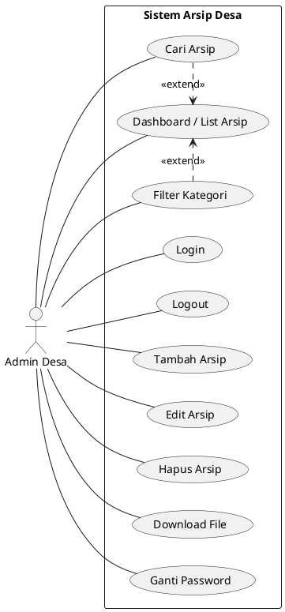

# Dokumentasi Use Case Diagram - Sistem Arsip Desa

**Deskripsi Diagram:**
Use Case Diagram pada Gambar [Nomor Gambar] menggambarkan interaksi antara aktor **Admin Desa** dengan **Sistem Arsip Desa**. Diagram ini merepresentasikan fungsi-fungsi utama sistem yang diidentifikasi pada tahap eksplorasi berdasarkan kebutuhan pengelolaan dokumen dan arsip digital di kantor desa. Fungsi-fungsi tersebut mencakup manajemen data arsip (menambah, mengubah, menghapus), pencarian dokumen, pengunduhan file, serta pengaturan keamanan akun admin.

## Kode PlantUML
Salin kode berikut ke editor PlantUML Anda:

### Tips Penanganan Error:
1. **Penting**: Pastikan baris pertama adalah `@startuml` (tanpa kata tambahan di belakangnya) dan baris terakhir adalah `@enduml`.
2. Jika Anda menyalin kode ke editor, pastikan tidak ada karakter aneh yang ikut tersalin.
3. Kode ini sudah dites dan kompatibel dengan standar PlantUML terbaru.
